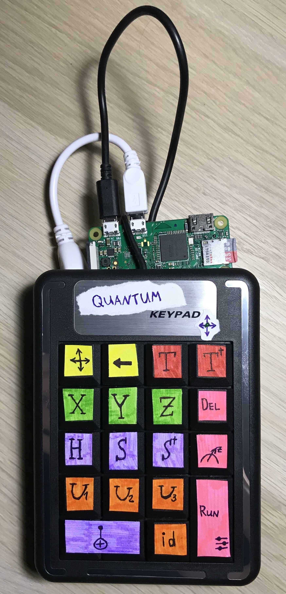
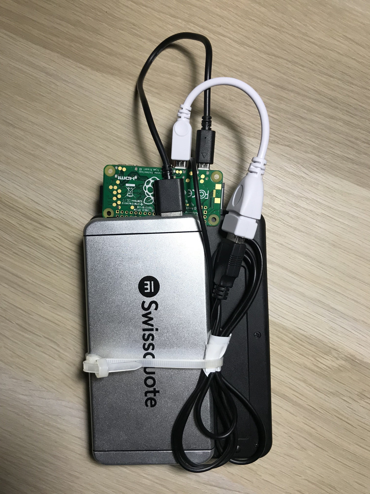
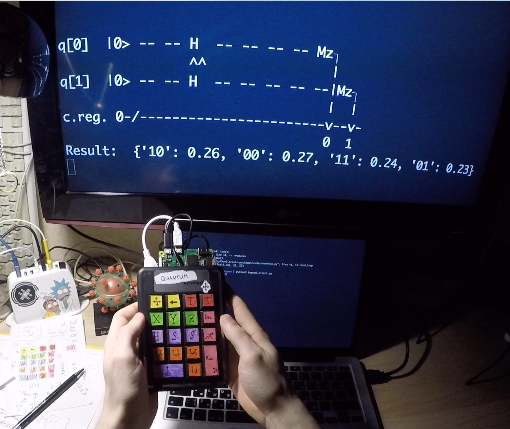
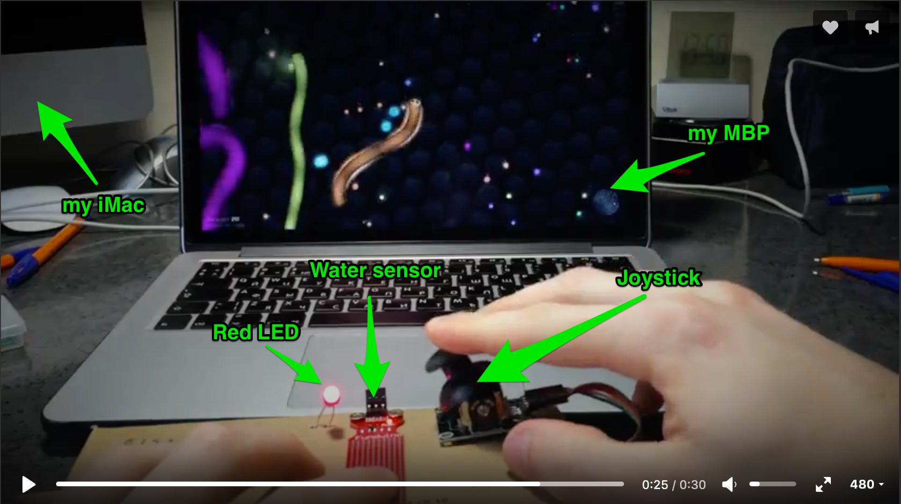
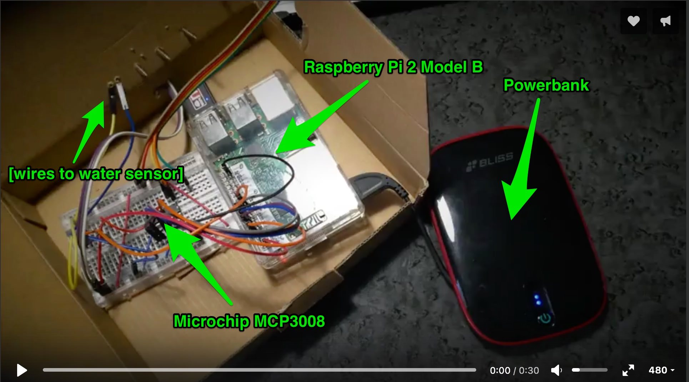

## Quantum Keypad

[[video demonstration](https://youtu.be/EVqfnaaUThU)]

All the code can be found in [quantum_keypad/](quantum_keypad/) folder.

Here I used [Raspberry Pi Zero W](https://www.raspberrypi.org/products/raspberry-pi-zero-w/).

| Front side | Back side     |
| :------------- | :------------- |
|        |        |

| Bell State | Result of two Hadamard gates     |
| :------------- | :------------- |
|        |        |

## Joystick

| [[video demonstration 1](https://youtu.be/bS0-Sjmxa1g)] | [[video demonstration 2](https://youtu.be/AWBQyz4jdUo)]     |
| :------------- | :------------- |
|        |        |

All the code can be found in [mouse_controller/](mouse_controller/) folder.

`Server` was launched on MacBook and `client` was launched on [Raspberry Pi 2 Model B](https://www.raspberrypi.org/products/raspberry-pi-2-model-b/).

Raspberry Pi was used as a controller with joystick and water sensor (it simulates the pressing of Space bar).

| Action | Inside the box     |
| :------------- | :------------- |
|        |        |

## Additional software

| Name | Description     |
| :------------- | :------------- |
| [Etcher](https://etcher.io)       | Burn [Raspbian images](https://www.raspberrypi.org/downloads/raspbian/) to Raspberry Pi      |
| [slither.io](http://slither.io)  | Used this game to test my Joystick made with water sensor  |
| [autopy](https://github.com/msanders/autopy/)  | Used for controlling the mouse on my MacBook from Python script. Supports only Python 2 |
| [evdev](https://github.com/gvalkov/python-evdev)  | Python package helped me a lot to read inputs from keypad and turn it into Quantum Keypad. [Here](http://python-evdev.readthedocs.io/en/latest/tutorial.html) one can find awesome tutorial on how to use the evdev  |
| [QISKit](https://www.qiskit.org)   | Quantum simulator to evaluate quantum circuits  |
| [ModelQ](https://www.qiskit.org/modelq/)   | Inspiration  |
